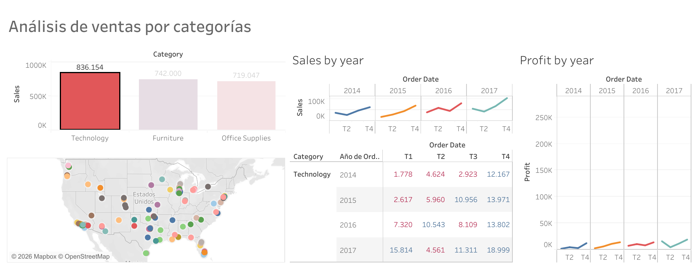

# tableau-sales-dashboard
Interactive Sales and Profit Dashboard built with Tableau Public.

# 📊 Tableau Sales Dashboard

## Overview

This project presents an interactive sales dashboard developed with Tableau Public to analyze sales performance, profitability, and product categories.

The dashboard helps identify business trends and supports data-driven decision-making.

---

## Business Objective

The objective of this project is to analyze:

- Sales performance over time
- Profit trends
- Sales by category
- Business insights through interactive visualizations

---

## Dashboard Preview

### Main Dashboard



---

## Key Insights

- Technology generated the highest overall profit.
- Furniture achieved high sales but lower profitability.
- Sales showed an increasing trend over time.
- Office Supplies maintained stable performance across multiple years.

---

## Tools Used

- Tableau Public
- Microsoft Excel
- Data Visualization
- Business Intelligence

---

## Interactive Dashboard

You can explore the interactive dashboard here:

👉 
https://public.tableau.com/app/profile/helen.cruz/viz/Salesvsprofitbyyear/Ventasporcategoria

---

## Repository Structure

```
tableau-sales-dashboard
│
├── images
├── README.md
└── LICENSE
```

---

## Skills Demonstrated

- Data Visualization
- Dashboard Design
- KPI Analysis
- Business Intelligence
- Storytelling with Data

---

## Author

Helen Cruz

Computer Engineering Student — ESPOL

GitHub:
https://github.com/mochifreeze-cc

LinkedIn:
https://www.linkedin.com/in/helen-cm-/

Website:
https://public.tableau.com/views/Salesvsprofitbyyear/Dashboard2?:language=es-ES&:sid=&:redirect=auth&:display_count=n&:origin=viz_share_link
